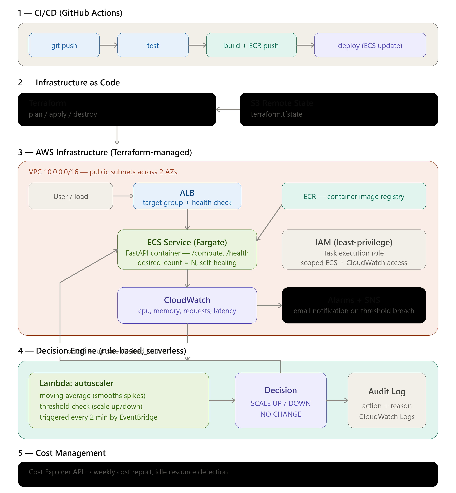

# AutoPilot Infra — Autonomous Cloud/DevOps Platform

> Terraform ile uçtan uca tanımlanmış, kendi kendini izleyen ve ölçeklendiren, sunucusuz bir otomatik ölçeklendirme motoruna sahip AWS ECS Fargate platformu.

[]()
[]()
[]()

---

## Bu Proje Nedir?

AutoPilot Infra, bir web servisini AWS'de çalıştıran, ancak asıl değeri **onu çevreleyen otomasyon ve altyapı** olan uçtan uca bir Cloud/DevOps sistemidir. Sistem;

- Tüm altyapısını **kod olarak** (Terraform) tanımlar — tek komutla sıfırdan kurulabilir,
- Her kod değişikliğini **otomatik** olarak test edip dağıtır (GitHub Actions CI/CD),
- CloudWatch metriklerini analiz ederek **kendi kendine** ölçeklenir (Lambda + EventBridge),
- Kararlarını denetlenebilir şekilde loglar, kritik durumlarda **otomatik bildirim** gönderir,
- **Sıfır kesintili** dağıtım yapar ve maliyetini raporlar.

Bu bir üretim-ölçekli sistem değil, kontrollü bir ortamda geliştirilmiş bir **portfolyo / öğrenme projesidir** — ancak tüm metrikler gerçek ölçümlere dayanır.

---

## Proje İki Repodan Oluşur

Uygulama kodu ile altyapı kodu, bilinçli olarak ayrı repolarda tutulmuştur (*separation of concerns*):

| Repo | İçerik |
|------|--------|
| **[autopilot-infra-terraform](https://github.com/Furkanbariss/autopilot-infra-terraform)** *(bu repo)* | Altyapı: Terraform/IaC, Lambda, monitoring, autoscaler, dokümantasyon |
| **[autopilot-app](https://github.com/Furkanbariss/autopilot-app)** | Uygulama: FastAPI servisi, Dockerfile, CI/CD workflow |

Bu ayrım, her bileşenin bağımsız versiyonlanmasını ve uygulama değişikliklerinin altyapıdan bağımsız deploy edilmesini sağlar. (bkz. [ADR-0010](docs/adr/0010-iki-repo-ayrimi.md))

---

## Mimari



> Detaylı mimari açıklaması için → **[docs/architecture.md](docs/architecture.md)**

Kısaca akış:

1. **Kullanıcı/yük** → ALB → ECS Fargate'deki FastAPI container'ı
2. **Kod push** → GitHub Actions (test → build → ECR push → ECS deploy)
3. **CloudWatch** → CPU/memory/request metriklerini toplar
4. **Lambda (EventBridge ile 2 dk'da bir)** → metrikleri analiz eder, ölçeklendirme kararı verir → ECS `desired_count`'u günceller
5. **CloudWatch Alarms + SNS** → kritik durumda email bildirimi

---

## Öne Çıkan Özellikler

| Alan | Uygulama |
|------|----------|
| **Infrastructure as Code** | Terraform (modüler yapı, S3 remote state) |
| **CI/CD** | GitHub Actions (test → build → ECR → ECS deploy) |
| **Container Orchestration** | AWS ECS Fargate (serverless) |
| **Otomatik Ölçeklendirme** | Lambda + EventBridge, kural-tabanlı karar motoru |
| **Zero-Downtime Deploy** | ECS rolling update (`minimum_healthy_percent=100`) |
| **Güvenlik** | IAM least-privilege (autoscaler yalnızca tek ECS service'i yönetir) |
| **Gözlemlenebilirlik** | CloudWatch Alarms + SNS email bildirimi, audit logging |
| **Maliyet Yönetimi** | Cost Explorer tabanlı raporlama + idle kaynak tespiti |

---

## Ölçülen Metrikler

Tüm metrikler kontrollü test ortamında **gerçekten ölçülmüştür** (ölçüm yöntemleri [docs/metrics-and-testing.md](docs/metrics-and-testing.md)'de):

| Metrik | Değer | Açıklama |
|--------|-------|----------|
| **Altyapı kurulum (RTO)** | ~3.5 dakika | `terraform destroy` sonrası tüm ortamın sıfırdan kurulumu |
| **CI/CD deploy süresi** | ~1 dakika | GitHub Actions pipeline (test + build + deploy) |
| **Ölçeklendirme tepki süresi** | ~57 saniye | Scale-up kararından yeni task'ın "Running" olmasına kadar |
| **Deployment kesinti** | 0 başarısız istek | Deploy sırasında sürekli trafik altında (kanıt: [`deploy-probe.log`](deploy-probe.log)) |

---

## Teknolojiler

**Altyapı & Cloud:** Terraform, AWS (ECS Fargate, Lambda, EventBridge, ALB, VPC, IAM, CloudWatch, S3, ECR, SNS, Cost Explorer)
**CI/CD:** GitHub Actions, Docker
**Uygulama & Otomasyon:** Python, FastAPI, boto3

---

## Detaylı Dokümantasyon

Bu ana sayfa bir özettir. Her bileşenin detayı ayrı sayfalarda:

| Doküman | İçerik |
|---------|--------|
| [Architecture](docs/architecture.md) | Sistem mimarisi, katmanlar, veri akışı |
| [Infrastructure](docs/infrastructure.md) | Terraform/IaC detayı (VPC, ECS, ALB, remote state) |
| [CI/CD](docs/cicd.md) | GitHub Actions pipeline detayı |
| [Autoscaling](docs/autoscaling.md) | Karar motoru, Lambda taşıma, ölçeklendirme mantığı |
| [Monitoring & Cost](docs/monitoring-and-cost.md) | CloudWatch Alarms, SNS, maliyet raporlama |
| [Metrics & Testing](docs/metrics-and-testing.md) | Ölçüm yöntemleri, test senaryoları, bilinen kısıtlamalar |
| [Architecture Decision Records](docs/adr/README.md) | Tüm mimari kararların gerekçeleri (9 ADR) |

---

## Bilinen Kısıtlama

Ani ve aşırı yük artışlarında (örn. 5x paralel istek, istek başına 500K iterations) **provisioning lag** gözlemlenmiştir: autoscaling'in yeni task ekleme hızı, yük artış hızının gerisinde kaldığında geçici timeout'lar oluşabilir. Bu, reaktif (metrik-tabanlı) autoscaling'in doğal bir sınırıdır. Olası iyileştirmeler (daha düşük scale-up eşiği, çoklu task ekleme, predictive scaling) [docs/metrics-and-testing.md](docs/metrics-and-testing.md)'de tartışılmıştır.

---

## Kurulum

```bash
# Repoyu klonla
git clone https://github.com/Furkanbariss/autopilot-infra-terraform.git
cd autopilot-infra-terraform

# Terraform ile altyapıyı kur
terraform init
terraform apply

# Uygulama image'ini build edip ECR'a push et (ilk kurulum)
# (detaylar docs/infrastructure.md'de)
```

---

*Geliştiren: Furkan Barış Sönmezışık — [github.com/Furkanbariss](https://github.com/Furkanbariss)*
